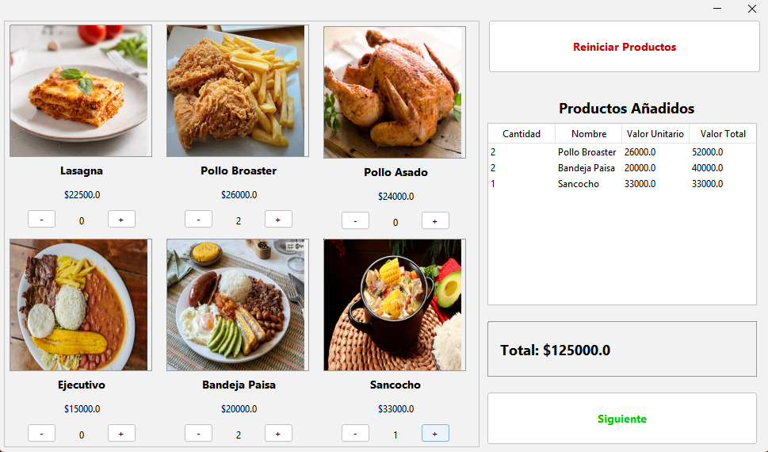
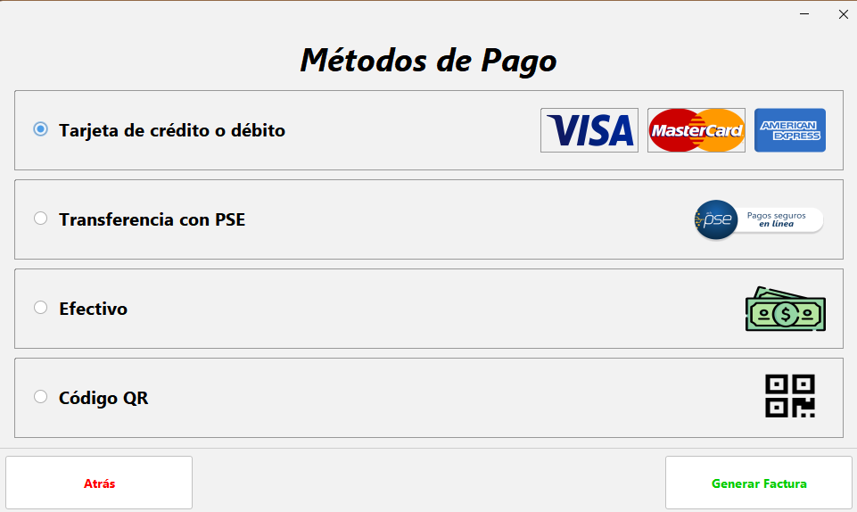

# Sistema de Gestión de Pedidos para Restaurante 🍽️

Aplicación de escritorio desarrollada en Java con interfaz gráfica (GUI) orientada a simular el flujo de ventas, selección de menú y facturación de un restaurante. 

Este es un proyecto académico enfocado en la aplicación práctica de principios de Programación Orientada a Objetos (POO), manejo de eventos y diseño de interfaces de usuario.

## Funcionalidades Principales

*   **Catálogo Interactivo:** Selección visual de platos (Lasagna, Pollo Broaster, Bandeja Paisa, etc.) con controles dinámicos para ajustar las cantidades (+ y -).
*   **Carrito de Compras en Tiempo Real:** Visualización instantánea de los productos añadidos, valor unitario y cálculo automático del subtotal y valor total de la orden.
*   **Módulo de Pagos:** Simulación de una pasarela de facturación con múltiples métodos de pago integrados:
    *   Tarjeta de crédito o débito (Visa, MasterCard, Amex)
    *   Transferencia con PSE
    *   Efectivo
    *   Código QR

## Capturas de Pantalla

### Interfaz del Menú y Carrito de Compras


### Pasarela de Pagos Simulada


## Tecnologías y Herramientas Utilizadas

*   **Lenguaje:** Java
*   **Entorno de Desarrollo (IDE):** Apache NetBeans
*   **Interfaz Gráfica:** Java Swing / AWT
*   **Arquitectura:** Programación Orientada a Objetos (POO)

## Cómo ejecutar el proyecto localmente

1. Clona este repositorio en tu máquina local:
   ```bash
   git clone [https://github.com/tu-usuario/sistema-pedidos-restaurante-java.git](https://github.com/tu-usuario/sistema-pedidos-restaurante-java.git)
